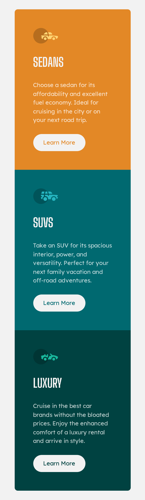

# Frontend Mentor - 3-column preview card component solution

This is a solution to the [3-column preview card component challenge on Frontend Mentor](https://www.frontendmentor.io/challenges/3column-preview-card-component-pH92eAR2-).

## Table of contents

- [Frontend Mentor - 3-column preview card component solution](#frontend-mentor---3-column-preview-card-component-solution)
  - [Table of contents](#table-of-contents)
  - [Overview](#overview)
    - [The challenge](#the-challenge)
    - [Screenshot](#screenshot)
    - [Links](#links)
  - [My process](#my-process)
    - [Built with](#built-with)
    - [What I learned](#what-i-learned)
    - [Continued development](#continued-development)
    - [Useful resources](#useful-resources)
  - [Author](#author)

## Overview
I'm starting to better understand CSS Grid and general CSS principles, and this has been my fastest completed project to date. I didn't struggle too much with this project and I was able to create most of this without having to use external resources, so that was a small win for me. Overall, this was a fun project to build and solidifies what I've been learning so far.

### The challenge

Users should be able to:

- View the optimal layout depending on their device's screen size
- See hover states for interactive elements

### Screenshot


<p>Screenshot of the solution at 375px</p>

### Links

- Solution URL: [Frontend Mentor Solution](https://www.frontendmentor.io/solutions/3column-preview-card-component-FmVIPKPoBT)
- Live Site URL: [Github Page](https://imjustamygdala.github.io/FrontendMentorChallenges/3-column-preview/)

## My process
I really enjoy working with CSS Grid and prefer it to CSS Flex when creating the core structure of a site, for now at least :D. I begin with looking at both mobile and desktop design files so I can determine the HTML5 markup, and then I focus on the mobile design and layout once the core of the HTML is written.

### Built with

- Semantic HTML5 markup
- CSS custom properties
- CSS Grid
- Mobile-first workflow

### What I learned

I recently learned variables in CSS have scope, so I was able to utilize a scoped variables to get the button hover effect to work effortlessly, and is probably what I'm most proud of with this simple project. I declared `--bg-clr:` per `.product__item` and the button was then able to use it's respective containers variable to set its colors on hover/focus.

```css
.product__item:nth-child(1) {
    --bg-clr: var(--clr-primary-400);
    background-color: var(--bg-clr);
}

.product__item:nth-child(2) {
    --bg-clr: var(--clr-primary-600);
    background-color: var(--bg-clr);
}

.product__item:nth-child(3) {
    --bg-clr: var(--clr-primary-800);
    background-color: var(--bg-clr);
}

.button {
    background-color: var(--clr-neutral-200);
    color: var(--bg-clr);
    border: 2px solid transparent;
}

.button:is(:hover, :focus) {
    background-color: var(--bg-clr);
    border: 2px solid var(--clr-neutral-200);
    color: var(--clr-neutral-200);
}
```

### Continued development

I'm wanting to continue my learning with semantic HTML and vanilla CSS, so I will continue to practice with Frontend Mentor until I feel comfortable with fundamentals and can apply simple designs without much fuss.

As I'm learning about semantic HTML, I still don't always know when it's "best practice" to implement something like for example a `div`. In this project, I had to wrap the `button` in a div so that the button wouldn't be a direct child of the grid container and the reasoning to wrapping the `button` was so that I could avoid adjusting its widths.

### Useful resources

- [Kevin Powell's Youtube](https://www.youtube.com/@KevinPowell) - I utilized what I learned from the previous project, [Product Preview Card Component](https://github.com/imjustamygdala/FrontendMentorChallenges/tree/main/product-preview), which utilized several of Kevin's video's.

## Author

- Frontend Mentor - [@imjustamygdala](https://www.frontendmentor.io/profile/imjustamygdala)